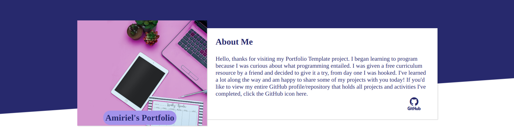
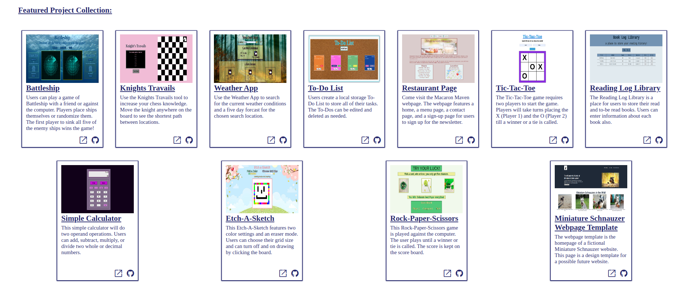
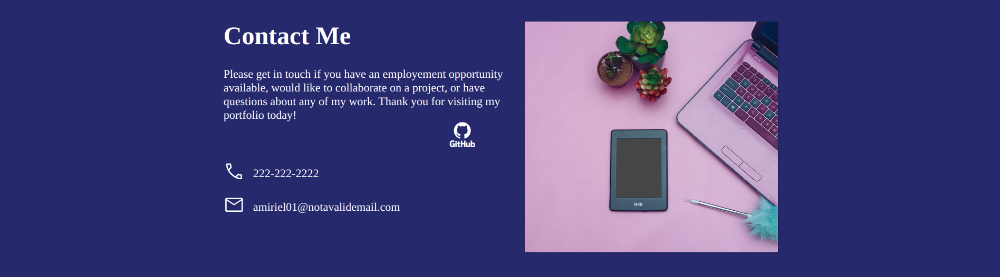

# Portfolio-Template

**Objective**

I created the Portfolio Template to keep all my projects in a central website location. This is a working website portfolio that I will add new projects to as I create them. 

***Images***

***Features***

The portfolio template features a header section that has a little about me, and my GitHub profile/repository link.

The body of the portfolio template features my favorite projects to date. The project cards show an image, the project name and description, plus links to view the projects and the project respositories. 

The footer of the portfolio has a little information, an area for me to add contact information at a later time, and my GitHub profile/repository link again.

Credits:

Computer Desk Images: https://www.pexels.com  Author: Adrienne Andersen